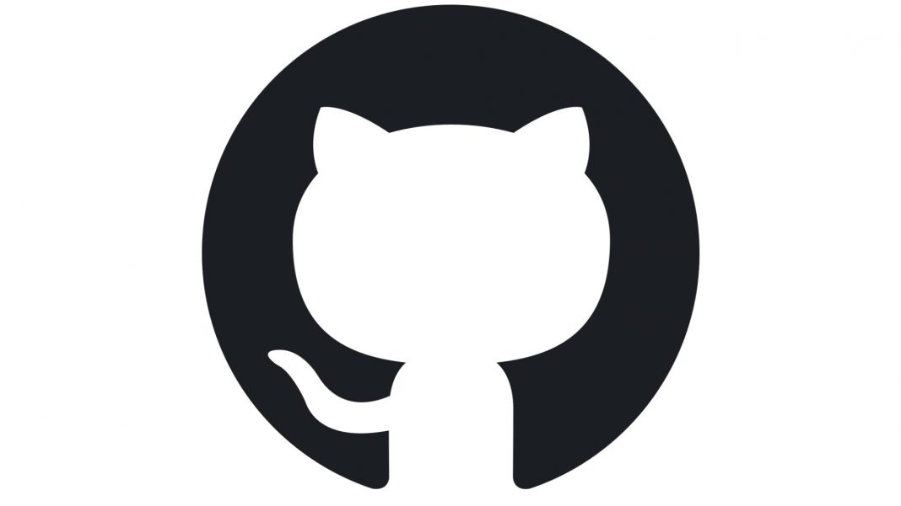

 

  

 

  Visi Dicoding adalah <strong>menjadi platform edukasi teknologi terdepan yang mendorong akses literasi digital yang lebih luas untuk semua</strong>. Dicoding memiliki misi untuk <strong>mengakselerasi transisi Indonesia menuju dunia digital melalui pendidikan teknologi yang mentransformasi kehidupan. </strong>
  <a href="https://www.dicoding.com/about">More Information</a>

 

---

 

  

<h2 align="center">Github</h2>

Deskripsi

    GitHub adalah layanan host web bersama yang menggunakan sistem kendali versi Git dan layanan hosting internet. GitHub memberikan kontrol akses dan beberapa fitur kolaborasi seperti pelacakan bug, manajemen tugas, dan wiki untuk setiap proyek. GitHub menawarkan paket repositori pribadi dan gratis digunakan untuk proyek perangkat lunak open source (sumber terbuka). GitHub mempunyai lebih dari 40 juta pengguna dan 190 juta repositori yang menjadikannya layanan terbesar dari kode sumber di dunia.

 - GitHub adalah solusi wadah atau alat untuk berkolaborasi dengan tim ketika mengembangkan sebuah proyek repository. 
 - GitHub dapat memuat profil dan proyek Anda sehingga dapat dijadikan portofolio dalam berkarier. 
 - GitHub memiliki ratusan juta public repository yang dapat dijadikan referensi dalam mengembangkan perangkat lunak. 

Daftar Modul

1. Belajar Dasar Git dengan GitHub [[📃](https://www.dicoding.com/certificates/RVZK1G7VEPD5)]

    

    Pelajari cara mengelola data atau kode menggunakan Git dengan GitHub, mulai dari dasar-dasar Git hingga berkolaborasi dengan tim.
  
  

  
  

---

 

  

<h2 align="center">Machine Learning Developer</h2>

Deskripsi

    Seorang Machine Learning Developer adalah pakar dalam menggunakan data untuk model pelatihan. Model-model tersebut kemudian digunakan untuk mengotomatisasi proses seperti klasifikasi gambar, pengenalan suara, dan perkiraan pasar. Sering kali ada penggabungan dengan peran data scientist atau artificial intelligence (AI) engineer. Machine learning adalah subbidang AI yang berfokus pada analisis data untuk menemukan hubungan antara input dan output yang diinginkan. Seorang pengembang pemelajaran mesin harus mampu menghasilkan solusi yang dibuat khusus untuk setiap masalah dan mencapai hasil optimal dengan hati-hati memproses data dan memilih algoritma terbaik untuk konteks yang diberikan.

    Kurikulum Machine Learning di Dicoding telah dikembangkan langsung bersama IBM dan Google menggunakan kurikulum resmi dari masing-masing perusahaan. Setiap langkah dalam learning path ini telah didesain agar siswa dapat memiliki pengetahuan yang cukup untuk menjadi seorang Machine Learning Developer yang dapat memenuhi kebutuhan industri.

Daftar Modul

1. Belajar Dasar Visualisasi Data [[📃](https://www.dicoding.com/certificates/EYX4RNJ85XDL)]

    

    Pelajari teknik dasar untuk representasi hasil secara visual sehingga dapat menceritakan dan mempresentasikan data secara efektif.

2. Memulai Pemrograman Dengan Python [[📃](https://www.dicoding.com/certificates/QLZ918332P5D)]

    

    Belajar Python yang menjadi landasan penting berbagai tren industri seperti ilmu data, pemelajaran mesin, dan manajemen infrastruktur.
  
  

