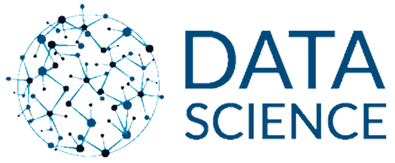

 

  

 

  Visi Dicoding adalah <strong>menjadi platform edukasi teknologi terdepan yang mendorong akses literasi digital yang lebih luas untuk semua</strong>. Dicoding memiliki misi untuk <strong>mengakselerasi transisi Indonesia menuju dunia digital melalui pendidikan teknologi yang mentransformasi kehidupan. </strong>
  <a href="https://www.dicoding.com/about">More Information</a>

 

--------------------------------------------------------------------------------------------------------------------------------------------------------------------------

 
<h1 align="center">Machine Learning Developer</h1>

  

  

    Kurikulum Machine Learning di Dicoding telah dikembangkan langsung bersama IBM dan Google menggunakan kurikulum resmi dari masing-masing perusahaan agar dapat memenuhi        kebutuhan industri.
  

  
<h2 align="center">Deskripsi</h2>

    

        Seorang Machine Learning Developer adalah pakar dalam menggunakan data untuk model pelatihan. Model-model tersebut kemudian digunakan untuk mengotomatisasi proses           seperti klasifikasi gambar, pengenalan suara, dan perkiraan pasar. Sering kali ada penggabungan dengan peran data scientist atau artificial intelligence (AI)                engineer. Machine learning adalah subbidang AI yang berfokus pada analisis data untuk menemukan hubungan antara input dan output yang diinginkan. Seorang                    pengembang pemelajaran mesin harus mampu menghasilkan solusi yang dibuat khusus untuk setiap masalah dan mencapai hasil optimal dengan hati-hati memproses 
        data dan memilih algoritma terbaik untuk konteks yang diberikan.
    

<h2 align="center">Daftar Modul</h2>

  
## 1. Belajar Dasar Visualisasi Data[[📃- Certificate](https://www.dicoding.com/certificates/EYX4RNJ85XDL)]
   

## 2. Memulai Pemrograman Dengan Python [[📃 - Certificate](https://www.dicoding.com/certificates/QLZ918332P5D)]
   
  
## 3. Belajar Machine Learning untuk Pemula [[📃 - Certificate](https://www.dicoding.com/certificates/07Z6L2Q62PQR)]
     
  ### Project
  - Berbagai Latihan [[📁 Here](https://github.com/ToniAS21/Dicoding/tree/main/Machine%20Learning%20Pemula/File%20latihan%20ML%20Pemula)]
  - Final Submission - Image Classification [[📁 Here](https://github.com/ToniAS21/Dicoding/blob/main/Machine%20Learning%20Pemula/PA_Klasifikasi_Gambar.ipynb)]
   
## 4. Belajar Pengembangan Machine Learning [[📃 - Certificate](https://www.dicoding.com/certificates/MRZMKJGYRPYQ)]
     
  ### Project
  - Submission 1 - Project Natural Language Processing (NLP) [[📁 Here](https://github.com/ToniAS21/Dicoding/blob/main/Machine%20Learning%20Pengembangan/Project_NLP.ipynb.ipynb)]
  - Submission 2 - Time Series [[📁 Here](https://github.com/ToniAS21/Dicoding/blob/main/Machine%20Learning%20Pengembangan/Project_Time_Series.ipynb.ipynb)]
  - Submission 3 - Image Classification [[📁 Here](https://github.com/ToniAS21/Dicoding/blob/main/Machine%20Learning%20Pengembangan/Project_Image_Classification.ipynb.ipynb)]

## 5. Machine Learning Terapan [[📃 - Certificate](https://www.dicoding.com/certificates/07Z6GGDLWXQR)]
   
   ### Project
   - Proyek Pertama [[📁 Here](https://github.com/ToniAS21/Dicoding/tree/main/Machine%20Learning%20Terapan%20(MLT)/Proyek%20Pertama)]
   - Proyek Akhir [[📁 Here](https://github.com/ToniAS21/Dicoding/tree/main/Machine%20Learning%20Terapan%20(MLT)/Proyek%20Akhir)]

## 6. Machine Learning Operations (MLOps) [[📃 - Certificate](https://www.dicoding.com/certificates/JLX1L5ORJX72)]
     
   ### Project
   - Project 1 MLOps [[📁 Here](https://github.com/ToniAS21/Dicoding/tree/main/Machine%20Learning%20Operations%20(MLOps)/Project%20I%20Machine%20Learning%20Operations%20(ML%20Ops))]     
   - Project 2 ML Ops [[📁 Here](https://github.com/ToniAS21/Dicoding/tree/main/Machine%20Learning%20Operations%20(MLOps)/Project%20II%20Machine%20Learning%20Operations%20(ML%20Ops))]

--------------------------------------------------------------------------------------------------------------------------------------------------------------------------

 
<h1 align="center">Data Scientist</h1>

  

  

    Kurikulum lengkap yang didesain oleh tim expert Dicoding bersama para praktisi industri. Siswa dipersiapkan untuk menjadi seorang Data Scientist berstandar global.
  

  
<h2 align="center">Deskripsi</h2>

    

        Perkembangan teknologi yang masif berbanding lurus dengan maraknya data yang diperoleh oleh setiap perusahaan. Agar tetap dapat bersaing, banyak perusahaan menggunakan data science untuk mengolah data hingga menjadi informasi yang dibutuhkan.
    

<h2 align="center">Daftar Modul</h2>

  
## 1. Belajar Dasar Data Science[[📃- Certificate](https://www.dicoding.com/certificates/QLZ94707DP5D)]
   

## 2. Belajar Dasar Structured Query Language (SQL) [[📃 - Certificate](https://www.dicoding.com/certificates/2VX3OR3RJZYQ)]
   

## 3. Memulai Pemrograman dengan Python [[📃 - Certificate](https://www.dicoding.com/certificates/QLZ918332P5D)]
   

## 4. Belajar Analisis Data dengan Python [[📃 - Certificate](https://www.dicoding.com/certificates/MRZM8E7ENZYQ)]
   
   ### Project
   - Proyek Analisis Data:E-Commerce Analysis [[📁 Here](https://github.com/ToniAS21/Analisis-Data-Python)]

  
## 5. Belajar Machine Learning untuk Pemula [[📃 - Certificate](https://www.dicoding.com/certificates/07Z6L2Q62PQR)]
     
  ### Project
  - Berbagai Latihan [[📁 Here](https://github.com/ToniAS21/Dicoding/tree/main/Machine%20Learning%20Pemula/File%20latihan%20ML%20Pemula)]
  - Final Submission - Image Classification [[📁 Here](https://github.com/ToniAS21/Dicoding/blob/main/Machine%20Learning%20Pemula/PA_Klasifikasi_Gambar.ipynb)]

## 6. Belajar Pengembangan Machine Learning [[📃 - Certificate](https://www.dicoding.com/certificates/MRZMKJGYRPYQ)]
     
  ### Project
  - Submission 1 - Project Natural Language Processing (NLP) [[📁 Here](https://github.com/ToniAS21/Dicoding/blob/main/Machine%20Learning%20Pengembangan/Project_NLP.ipynb.ipynb)]
  - Submission 2 - Time Series [[📁 Here](https://github.com/ToniAS21/Dicoding/blob/main/Machine%20Learning%20Pengembangan/Project_Time_Series.ipynb.ipynb)]
  - Submission 3 - Image Classification [[📁 Here](https://github.com/ToniAS21/Dicoding/blob/main/Machine%20Learning%20Pengembangan/Project_Image_Classification.ipynb.ipynb)]

 
<h1 align="center">Cloud Computing</h1>

  

  

    Kurikulum disusun oleh Dicoding bersama AWS beserta pelaku industri Back-End Development. 
  

  
<h2 align="center">Deskripsi</h2>

    

        Komputasi cloud telah berkembang secara signifikan dan semakin populer beberapa tahun terakhir. Salah satu platform cloud terdepan dan paling komprehensif adalah Amazon Web Services (AWS). Jutaan pelanggan telah menggunakan AWS, termasuk tiga unicorn asal Indonesia seperti Traveloka, Tokopedia, dan Gojek. 
    

<h2 align="center">Daftar Modul</h2>

  
## 1. Cloud Practitioner Essentials (Belajar Dasar AWS Cloud)[[📃- Certificate](https://www.dicoding.com/certificates/MEPJLOD5WZ3V)]
   

## 2. Architecting on AWS (Membangun Arsitektur Cloud di AWS)[[📃 - Certificate](https://www.dicoding.com/certificates/2VX32EN44PYQ)]
   
   

-----------------------------------------------------------------------------------------------------------------------------------------------------------------------------

 

  

<h2 align="center">Github</h2>

Deskripsi

    GitHub adalah layanan host web bersama yang menggunakan sistem kendali versi Git dan layanan hosting internet. GitHub memberikan kontrol akses dan beberapa fitur kolaborasi seperti pelacakan bug, manajemen tugas, dan wiki untuk setiap proyek. GitHub menawarkan paket repositori pribadi dan gratis digunakan untuk proyek perangkat lunak open source (sumber terbuka). GitHub mempunyai lebih dari 40 juta pengguna dan 190 juta repositori yang menjadikannya layanan terbesar dari kode sumber di dunia.

 - GitHub adalah solusi wadah atau alat untuk berkolaborasi dengan tim ketika mengembangkan sebuah proyek repository. 
 - GitHub dapat memuat profil dan proyek Anda sehingga dapat dijadikan portofolio dalam berkarier. 
 - GitHub memiliki ratusan juta public repository yang dapat dijadikan referensi dalam mengembangkan perangkat lunak. 

Daftar Modul

1. Belajar Dasar Git dengan GitHub [[📃](https://www.dicoding.com/certificates/RVZK1G7VEPD5)]

    

    Pelajari cara mengelola data atau kode menggunakan Git dengan GitHub, mulai dari dasar-dasar Git hingga berkolaborasi dengan tim.
  
  

  
  

---
